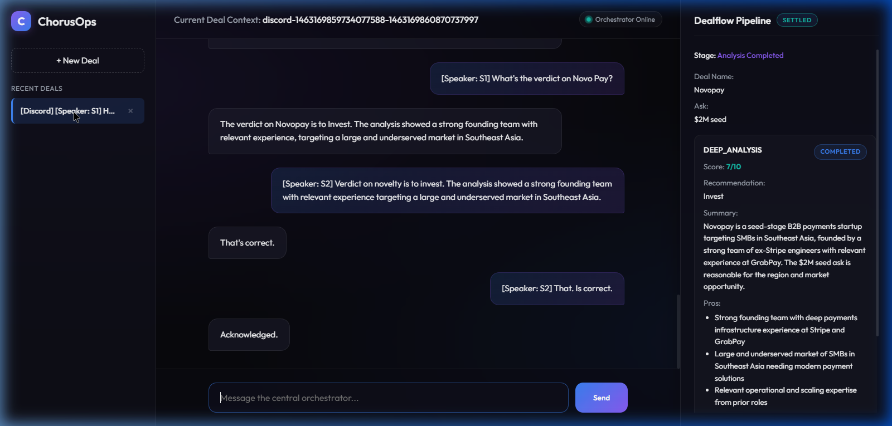
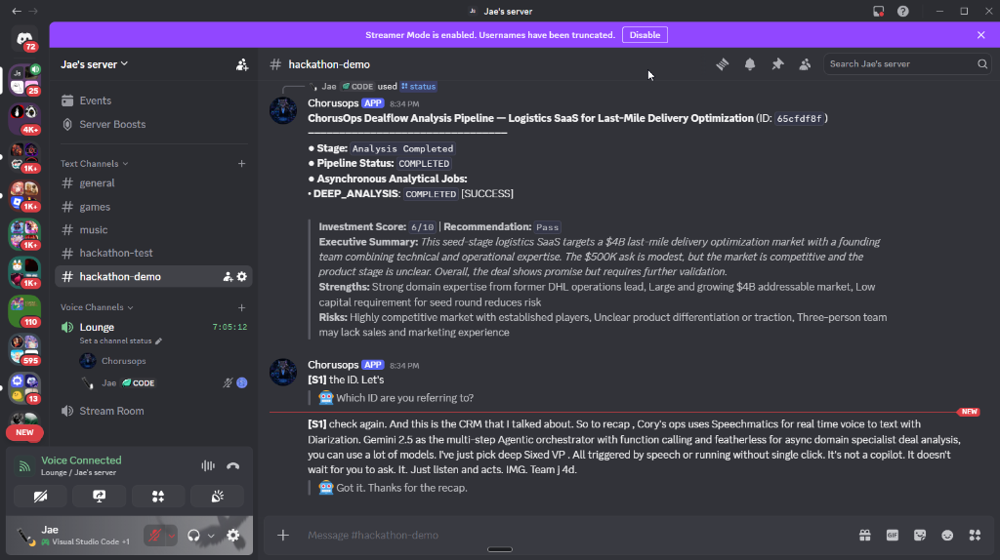

# ChorusOps — AI-Driven Real-Time Dealflow Orchestrator

ChorusOps is a next-generation **Voice-First Agentic Workflow** platform designed for modern venture capital and investment teams. It listens to a team's real-time discussion inside a Discord voice channel, transcribes the conversation with speaker attribution, plans and triggers complex analytical workflows using a central LLM planner, and dispatches heavy-lifting evaluations to an asynchronous background worker.

With a seamless **Voice In ➔ AI Brain ➔ Voice Out** loop, ChorusOps eliminates administrative friction from investment operations. A single hallway brainstorm is automatically transformed into structured, deep-dive analytical reports covering market viability, fit, risks, and financial sanity—all while the team continues to speak naturally.

---

## Interface Showcase

### 📊 Central Dealflow Dashboard


### 💬 Discord Voice & Text Client


---

## The Sensory Loop: Voice In ➔ AI Brain ➔ Voice Out

```
  [Team Discusses a Pitch in Lounge Voice Channel]
                     │
                     ▼
  [Voice In: Speechmatics Real-Time Diarization]
                     │  (Decodes Opus -> Mono PCM s16le, streams via WS)
                     ▼
  [AI Brain: Central Gemini Orchestrator]
                     │  (Maintains context, evaluates, modifies state delta)
                     ├─► [Asynchronous Featherless.ai Workers]
                     │     (Executes deep background analysis using specialized models)
                     ▼
  [Voice Out: Self-Hosted Kokoro-Web TTS]
                        (Speaks short, natural confirmation audio back in channel)
```

1. **Voice In (Sensing Layer):** Capture raw user audio streams from Discord voice channels using `@discordjs/voice`, pipe them through a `prism-media` Opus decoder to produce mono `PCM s16le` at 48kHz, and stream it to the **Speechmatics WebSocket API** with speaker diarization enabled. Speechmatics detects turns and flushes real-time, speaker-attributed text blocks.
2. **AI Brain (Cognitive Planner):** The **Google Gemini API** (using the new `@google/genai` SDK) processes the speaker-attributed turn. It decides whether to reply immediately or call asynchronous tooling (e.g., executing a deep-dive startup assessment task).
3. **Voice Out (Actuation Layer):** When Gemini responds, the bot extracts the key output, formats it for speech, synthesizes a highly realistic voice clip using a self-hosted **Kokoro-Web** docker container, and plays it directly in the voice channel—leaving a permanent, detailed Markdown log in the accompanying text channel.

---

## Key Prerequisites

To run this project locally and prepare it for submission, you will need:
- **Node.js:** version `18.x` or higher.
- **Docker:** (Required for self-hosted Kokoro TTS).
- **Google AI Studio Key:** (For the central Gemini planner).
- **Featherless.ai API Key:** (For the specialized background deep-analysis worker).
- **Speechmatics API Key:** (For real-time speech-to-text).
- **Discord Bot Token:** (Created via Discord Developer Portal).

---

## Setup & Quickstart

### 1. Configure the Environment
Clone the repository and copy the environment template:
```bash
cp .env.example .env
```

Open `.env` and fill in your keys:
```env
PORT=3000
BACKEND_URL=http://localhost:3000

# Central Planner (Google AI Studio)
GEMINI_API_KEY=your_gemini_key

# Speech-to-Text (Speechmatics Portal)
SPEECHMATICS_API_KEY=your_speechmatics_key

# Asynchronous Worker (Featherless.ai)
FEATHERLESS_API_KEY=your_featherless_key
FEATHERLESS_BASE_URL=https://api.featherless.ai/v1
FEATHERLESS_MODEL=meta-llama/Llama-3-70b-instruct

# Voice Client (Discord Developer Portal)
DISCORD_BOT_TOKEN=your_discord_token

# Self-Hosted Kokoro TTS (Default docker values)
TTS_ENABLED=true
TTS_BASE_URL=http://localhost:3001/api/v1
TTS_API_KEY=chorusops
TTS_VOICE=af_heart
```

---

### 2. Start the Self-Hosted TTS Server (Docker)
In a new terminal window, spin up the local Kokoro-Web TTS container. This handles all speech synthesis with zero rate-limits and zero cloud costs:
```bash
docker run -d \
  --name chorusops-tts \
  -p 3001:3000 \
  -e KW_SECRET_API_KEY=chorusops \
  --restart unless-stopped \
  ghcr.io/eduardolat/kokoro-web:latest
```

---

### 3. Install NPM Dependencies
Install the required packages in your local monorepo root:
```bash
npm install
```

---

### 4. Launch the Systems
For a complete local demo, you only need to spin up the Backend API Core and the Discord Bot Client in separate terminals.

*Note: The Backend Core automatically runs the embedded Asynchronous Analytical Worker internally to maintain fast database transaction speeds for this hackathon setup.*

**Terminal 1 (Backend API Core & Worker):**
```bash
npm run start:backend
```

**Terminal 2 (Discord Bot Client):**
```bash
npm run start:bot
```

---

## How to Test the Demo Flow

### 1. Invite the Bot
Generate an invitation link in your Discord Developer Portal. 
> [!IMPORTANT]
> You **must** select both the **`bot`** and the **`applications.commands`** scopes to allow modern Slash Commands (`/`) to populate and register dynamically in your guild.

### 2. Join the Voice Channel
Join a voice channel in your server (e.g., "Lounge").

### 3. Summon the Bot
Type the following slash command in a text channel:
```text
/join
```
The bot will join the Lounge voice channel, establish a secure WebSocket channel to Speechmatics, and print a confirmation message in the text channel.

### 4. Brainstorm & Pitch a Deal
Start speaking naturally in the voice channel! For example:
> *"Hey team, let's look at NovaPay. They are raising a 2 million seed round to build B2B payment rails for Southeast Asia."*

Speechmatics will stream, diarize, and log the turn. The Gemini Brain will analyze it and log context.

### 5. Dispatch Deep Analysis
Ask the bot:
> *"ChorusOps, please run a deep analysis on NovaPay."*

Gemini will automatically make a function call to the background worker. The bot will **speak back to you in the voice channel** using a natural Kokoro voice to confirm it has enqueued the background task:
> 🤖 *"Acknowledged, S1. I've dispatched a deep analysis for NovaPay on the Featherless worker queue."*

### 6. Start a New Deal Workspace (Voice Command)
To rotate to a completely fresh deal discussion during a meeting without reconnecting the bot:
```text
/new
```
The bot will spin up a fresh, blank canvas in Discord. Subsequent transcriptions will feed into this new workspace and show up in the web UI as a separate conversation!

### 7. Inspect Results
The Featherless background worker will pick up the task, run market/financial evaluations, and update the database state. You can check progress and view full structured results (scores, pros/cons, fit) at any time using:
```text
/status workflow_id:YOUR_WORKFLOW_ID
```

---

## Text-Only Browser Demo (No Discord Required)

If you want to test the central Gemini orchestrator and see the background analytical worker processes interact without setting up Discord or Speechmatics:
1. Ensure the **Backend API & Asynchronous Worker** is running (`npm run start:backend`).
2. Open the self-contained `demo/index.html` file directly inside any web browser.
3. Chat with the agent textually (e.g., *"Let's evaluate NovaPay"*), watch the background analysis populate on the visual pipeline, and check real-time pipeline status changes!

### **Premium Browser Demo Features:**
* 💾 **Persistent JSON Database:** All transcripts, analysis logs, pros/cons, scorecards, and historical deals are saved directly on disk at `data/store.json`. They are 100% persistent across server and dashboard reloads!
* 📋 **Dynamic Deal History Sidebar:** Fully diarized chats and deal metrics are compiled into a premium sidebar interface.
* 🔄 **Auto-Restore on Load:** The dashboard automatically restores your most active deal workspace upon loading, avoiding blank workspaces.
* ❌ **Workspace Deletion:** Delete individual workspaces instantly with visual feedback that synchronizes directly with the backend database.

---

## License
[MIT License](LICENSE) (c) 2026 JaePyJs.
